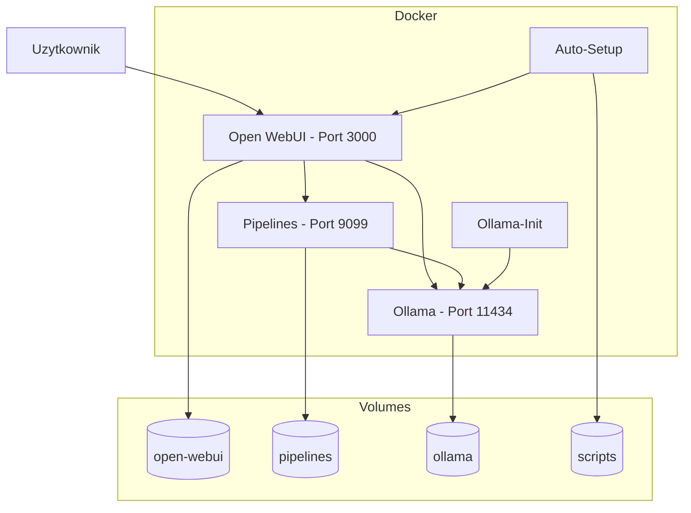
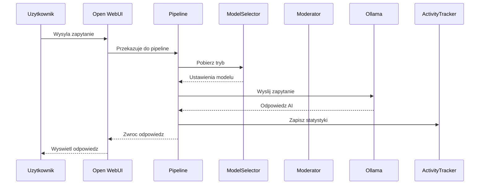
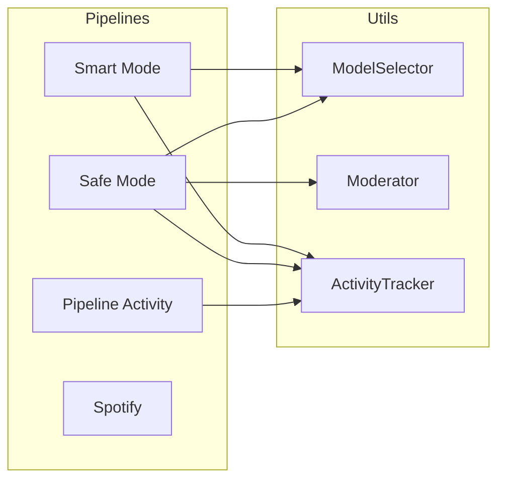

# Architektura Systemu Lokalna-Instalacja-LLM

## 1. Przeglad Systemu

System **Lokalna-Instalacja-LLM** to lokalne srodowisko uruchomieniowe dla modeli jezykowych (LLM), zbudowane w oparciu o architekture kontenerowa Docker.

---

## 2. Schematy Graficzne

### 2.1 Architektura Kontenerow Docker



### 2.2 Przeplyw Danych



### 2.3 Diagram Komponentow



---

## 3. Uslugi Docker

### 3.1 Ollama
- **Image**: ollama/ollama:latest
- **Port**: 11434
- **Modele**: gemma2:2b, llama3:latest, llama3.1:latest

### 3.2 Pipelines
- **Image**: ghcr.io/open-webui/pipelines:main
- **Port**: 9099

### 3.3 Open WebUI
- **Image**: open-webui-custom:latest
- **Port**: 3000

---

## 4. Tryby Operacyjne

| Tryb | RAM | Model | Max Tokens | Temperature |
|------|-----|-------|------------|-------------|
| Light | < 8 GB | gemma2:2b | 512 | 0.4 |
| Balanced | 8-16 GB | llama3:latest | 1024 | 0.5 |
| Advanced | > 16 GB | llama3.1:latest | 2048 | 0.6 |

---

## 5. Moduly Utils

### ModelSelector
Automatyczny dobor modelu na podstawie RAM.

### Moderator
Moderacja tresci dla Safe Mode - banned words, PII, jailbreak detection.

### ActivityTracker
Sledzenie aktywnosci pipelinow z persystencja do JSON.

---

## 6. Uruchomienie

```powershell
docker-compose up -d
```

- Open WebUI: http://localhost:3000
- Ollama API: http://localhost:11434
- Pipelines: http://localhost:9099
