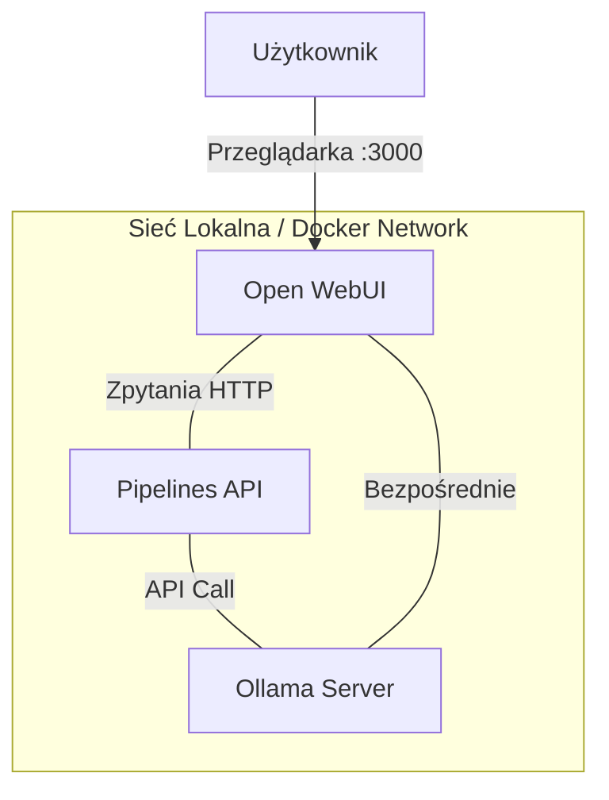
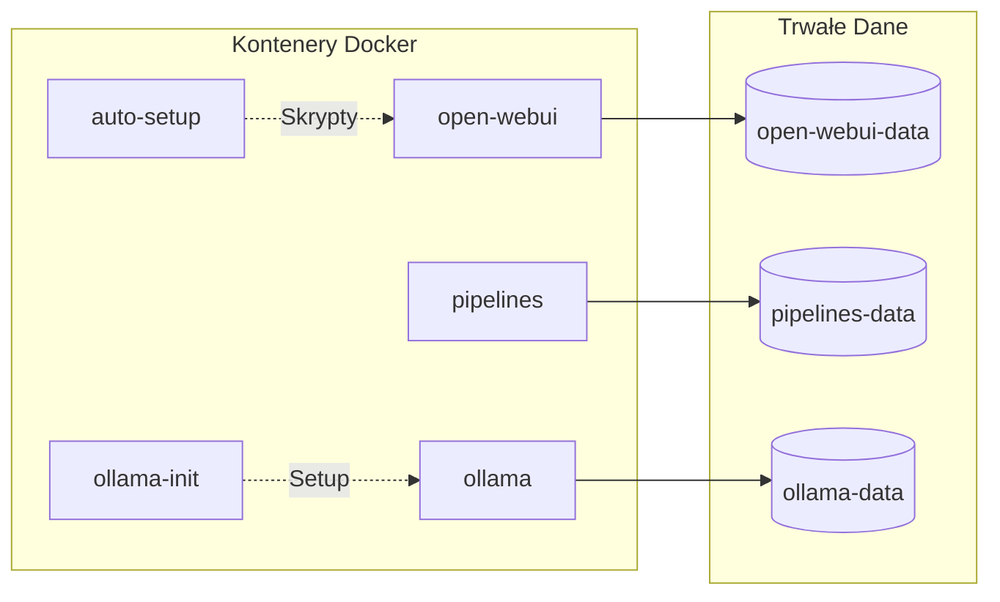
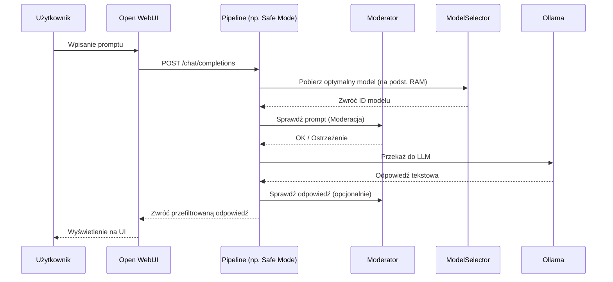
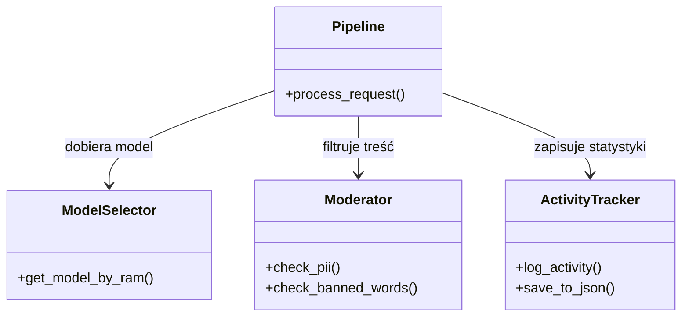

# Struktura Systemu - Schematy Graficzne

Ten dokument zawiera wizualną reprezentację architektury systemu **Lokalna-Instalacja-LLM**.

## 1. Architektura Wysokopoziomowa

Ogólny schemat połączeń między głównymi komponentami systemu.

## 2. Interakcja Kontenerów i Wolumenów

Szczegółowy widok usług Docker oraz ich powiązań z systemem plików (wolumenami).

## 3. Przepływ Zapytania (Data Flow)

Sekwencja zdarzeń od momentu wysłania pytania przez użytkownika do otrzymania odpowiedzi.

## 4. Diagram Komponentów Utils

Relacje między modułami pomocniczymi wewnątrz folderu `pipelines/utils`.

