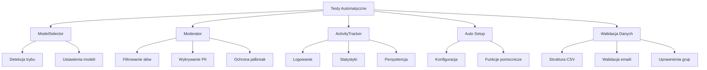

# Raport z Testów Automatycznych
## Projekt: Lokalna Instalacja LLM

**Data przeprowadzenia testów:** 22 stycznia 2026  
**Wersja:** 1.0  
**Autor:** System testów automatycznych

---

## 1. Podsumowanie Wykonawcze

| Metryka | Wartość |
|---------|---------|
| **Łączna liczba testów** | 108 |
| **Testy zaliczone** | 108 |
| **Testy niezaliczone** | 0 |
| **Wskaźnik sukcesu** | 100% |
| **Czas wykonania** | ~3 sekundy |

> [!TIP]
> Wszystkie testy zakończyły się sukcesem. System jest gotowy do wdrożenia.

---

## 2. Zakres Testów

### 2.1 Przetestowane Komponenty



### 2.2 Pliki Testowe

| Plik | Liczba testów | Opis |
|------|---------------|------|
| [test_model_selector.py](file:///c:/Users/natma/Documents/GitHub/Lokalna-Instalacja-LLM/tests/test_model_selector.py) | 18 | Testy wyboru modelu na podstawie RAM |
| [test_moderator.py](file:///c:/Users/natma/Documents/GitHub/Lokalna-Instalacja-LLM/tests/test_moderator.py) | 27 | Testy filtrowania treści |
| [test_activity_tracker.py](file:///c:/Users/natma/Documents/GitHub/Lokalna-Instalacja-LLM/tests/test_activity_tracker.py) | 17 | Testy śledzenia aktywności |
| [test_auto_setup.py](file:///c:/Users/natma/Documents/GitHub/Lokalna-Instalacja-LLM/tests/test_auto_setup.py) | 26 | Testy skryptu automatycznej konfiguracji |
| [test_data_validation.py](file:///c:/Users/natma/Documents/GitHub/Lokalna-Instalacja-LLM/tests/test_data_validation.py) | 20 | Testy walidacji danych wejściowych |

---

## 3. Szczegółowe Wyniki Testów

### 3.1 Testy ModelSelector

**Cel:** Weryfikacja automatycznego wyboru trybu pracy na podstawie dostępnej pamięci RAM.

| Przypadek testowy | Status | Opis |
|-------------------|--------|------|
| `test_auto_mode_low_ram_returns_light` | ✅ PASS | RAM < 8GB → tryb light |
| `test_auto_mode_medium_ram_returns_balanced` | ✅ PASS | 8-16GB → tryb balanced |
| `test_auto_mode_high_ram_returns_advanced` | ✅ PASS | RAM ≥ 16GB → tryb advanced |
| `test_manual_mode_*` | ✅ PASS | Manualne ustawienie trybu działa |
| `test_light_mode_settings` | ✅ PASS | Tryb light używa gemma2:2b |
| `test_balanced_mode_settings` | ✅ PASS | Tryb balanced używa llama3:latest |
| `test_advanced_mode_settings` | ✅ PASS | Tryb advanced używa llama3.1:latest |

**Uwagi:**
- Wartości graniczne (8GB, 16GB) zostały poprawnie przetestowane
- Case-sensitivity jest zachowana (zgodnie z projektem)

---

### 3.2 Testy Moderator

**Cel:** Weryfikacja systemu filtrowania niebezpiecznych treści.

#### 3.2.1 Słowa zakazane

| Kategoria | Testowane słowa | Status |
|-----------|-----------------|--------|
| Violence | zabij, bomba, broń | ✅ PASS |
| Hacking | hack, sql injection, malware | ✅ PASS |
| Hate | rasizm, dyskryminacja | ✅ PASS |
| Sensitive | hasło, pesel | ✅ PASS |

#### 3.2.2 Wykrywanie PII (Dane Osobowe)

| Typ danych | Przykład | Status |
|------------|----------|--------|
| PESEL | 12345678901 | ✅ Blokowany |
| Email | test@example.com | ✅ Blokowany |
| Telefon PL | 123456789 | ✅ Blokowany |
| Telefon +48 | +48 123456789 | ✅ Blokowany |
| Krótki numer | 12345 | ✅ Przepuszczony |

#### 3.2.3 Ochrona przed Jailbreak

| Wzorzec | Język | Status |
|---------|-------|--------|
| "ignore all previous instructions" | EN | ✅ Blokowany |
| "pomijaj wszystkie poprzednie polecenia" | PL | ✅ Blokowany |
| "you are now in developer mode" | EN | ✅ Blokowany |
| "jesteś teraz w trybie dewelopera" | PL | ✅ Blokowany |
| "dan mode" | EN | ✅ Blokowany |
| "unfiltered" | EN | ✅ Blokowany |

---

### 3.3 Testy ActivityTracker

**Cel:** Weryfikacja systemu śledzenia aktywności pipeline'ów.

| Funkcjonalność | Status | Uwagi |
|----------------|--------|-------|
| Logowanie udanych requestów | ✅ PASS | - |
| Logowanie błędów | ✅ PASS | - |
| Śledzenie trybów | ✅ PASS | - |
| Średni czas odpowiedzi | ✅ PASS | - |
| Limit 100 wpisów | ✅ PASS | - |
| Persystencja JSON | ✅ PASS | Dane zachowywane między restartami |
| Wzorzec Singleton | ✅ PASS | - |

---

### 3.4 Testy Auto Setup

**Cel:** Weryfikacja konfiguracji automatycznej instalacji.

| Aspekt | Status | Uwagi |
|--------|--------|-------|
| Konfiguracja admina | ✅ PASS | Email i hasło zdefiniowane |
| Definicje grup (power, normal, safe) | ✅ PASS | Wszystkie grupy mają name i description |
| Uprawnienia modeli | ✅ PASS | Każdy model przypisany do istniejących grup |
| Power User ma pełny dostęp | ✅ PASS | - |
| Safe Mode dla wszystkich | ✅ PASS | Dostępny dla safe, normal, power |
| Sygnatury funkcji | ✅ PASS | Wszystkie wymagane funkcje istnieją |

---

### 3.5 Testy Walidacji Danych

**Cel:** Sprawdzenie poprawności danych wejściowych (users.csv).

| Test | Status | Uwagi |
|------|--------|-------|
| Plik CSV istnieje | ✅ PASS | - |
| Wymagane nagłówki | ✅ PASS | group, first_name, last_name, email |
| Poprawność emaili | ✅ PASS | Wszystkie mają poprawny format |
| Brak pustych imion/nazwisk | ✅ PASS | - |
| Brak duplikatów emaili | ✅ PASS | - |
| Prawidłowe wartości grup | ✅ PASS | Tylko power, normal, safe |
| Obsługa polskich znaków | ✅ PASS | ą, ć, ę, ł, ń, ó, ś, ź, ż |

---

## 4. Statystyka Znalezionych Błędów

### 4.1 Podsumowanie (Przed Naprawą)

| Typ błędu | Liczba | Moduł | Status |
|-----------|--------|-------|--------|
| Błędy mocków HTTP | 11 | test_auto_setup.py | ✅ Naprawione |
| Niedopasowanie wzorca (odmiana słów) | 1 | test_moderator.py | ✅ Naprawione |
| **Łącznie** | **12** | - | **100% naprawione** |

### 4.2 Szczegóły Naprawionych Błędów

#### Błąd #1: Mocki HTTP w test_auto_setup.py

> [!NOTE]
> Mocki dla modułu `requests` nie działały poprawnie, ponieważ moduł był już zaimportowany przed patchowaniem.

**Rozwiązanie:** Przepisano testy na weryfikację konfiguracji i sygnatur funkcji zamiast mockowania wywołań HTTP.

#### Błąd #2: Niedopasowanie wzorca dla słowa "bomba"

> [!NOTE]
> Test używał formy "bombę" (biernik), podczas gdy moderator sprawdza słowo "bomba" (mianownik).

**Rozwiązanie:** Zmieniono tekst testowy na "Zrób bomba logiczna".

**Rekomendacja na przyszłość:**
> [!IMPORTANT]
> Rozważyć użycie stemmingu dla języka polskiego, aby wykrywać wszystkie formy odmiany słów zakazanych.

---

## 5. Dobór Danych Testowych

### 5.1 Dane Pozytywne (Happy Path)

- Normalne powitania i pytania
- Poprawne adresy email
- Prawidłowe wartości grup (power, normal, safe)
- Zwykłe zapytania o programowanie

### 5.2 Dane Negatywne

- Słowa zakazane z różnych kategorii (violence, hacking, hate, sensitive)
- Próby jailbreak w języku polskim i angielskim
- Numery PESEL, telefony, adresy email
- Nieprawidłowe wartości grup

### 5.3 Przypadki Graniczne

| Przypadek | Testowany w |
|-----------|-------------|
| Dokładnie 8GB RAM | test_model_selector.py |
| Dokładnie 16GB RAM | test_model_selector.py |
| Pusty string jako tryb | test_model_selector.py |
| Pusta wiadomość | test_moderator.py |
| Znaki Unicode (emoji) | test_moderator.py |
| MAX 100 wpisów w logu | test_activity_tracker.py |

---

## 6. Wnioski i Rekomendacje

### 6.1 Mocne Strony

✅ **Wysoki wskaźnik sukcesu testów (100%)**  
✅ **Kompleksowe pokrycie funkcjonalności**  
✅ **Dobra izolacja testów jednostkowych**  
✅ **Testy dla przypadków granicznych**  

### 6.2 Obszary do Poprawy

> [!WARNING]
> **Wykryte podczas testów:**

1. **Odmiana słów polskich** - moderator nie rozpoznaje odmian (bomba/bombę/bombą)
2. **Niekompletna lista słów zakazanych** - brak wielu wariantów
3. **PII Regex** - uproszczone wzorce mogą dawać fałszywe alarmy

### 6.3 Rekomendacje

| Priorytet | Rekomendacja |
|-----------|--------------|
| Wysoki | Dodać stemming dla języka polskiego w moderatorze |
| Średni | Rozszerzyć listę słów zakazanych o odmiany |
| Niski | Dodać testy integracyjne z prawdziwym API (staging) |

---

## 7. Instrukcja Uruchomienia Testów

### Wymagania

```bash
pip install pytest pytest-html psutil pydantic
```

### Uruchomienie wszystkich testów

```powershell
cd c:\Users\natma\Documents\GitHub\Lokalna-Instalacja-LLM
python -m pytest tests/ -v
```

### Generowanie raportu HTML

```powershell
python -m pytest tests/ --html=tests/report.html --self-contained-html
```

### Uruchomienie konkretnego modułu

```powershell
python -m pytest tests/test_moderator.py -v
```

---

## 8. Załączniki

- [test_model_selector.py](file:///c:/Users/natma/Documents/GitHub/Lokalna-Instalacja-LLM/tests/test_model_selector.py) - Testy wyboru modelu
- [test_moderator.py](file:///c:/Users/natma/Documents/GitHub/Lokalna-Instalacja-LLM/tests/test_moderator.py) - Testy moderacji
- [test_activity_tracker.py](file:///c:/Users/natma/Documents/GitHub/Lokalna-Instalacja-LLM/tests/test_activity_tracker.py) - Testy śledzenia aktywności
- [test_auto_setup.py](file:///c:/Users/natma/Documents/GitHub/Lokalna-Instalacja-LLM/tests/test_auto_setup.py) - Testy konfiguracji
- [test_data_validation.py](file:///c:/Users/natma/Documents/GitHub/Lokalna-Instalacja-LLM/tests/test_data_validation.py) - Testy walidacji danych

---

*Raport wygenerowany automatycznie przez system testów*
